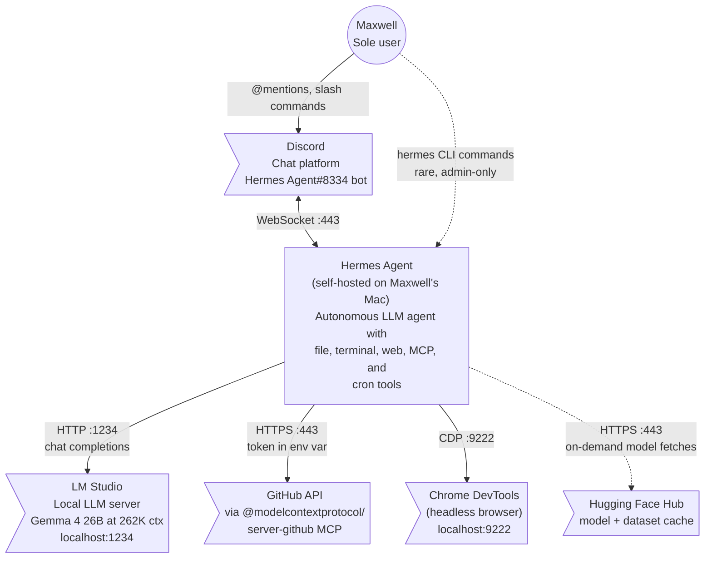
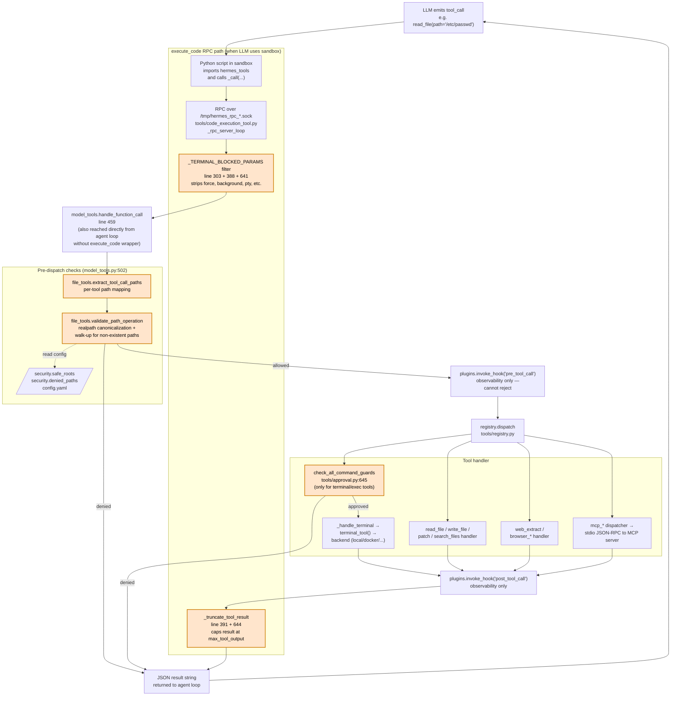
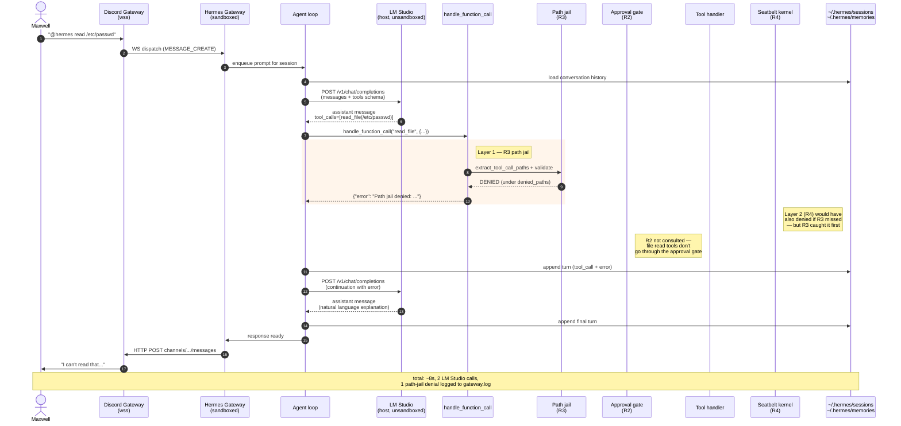
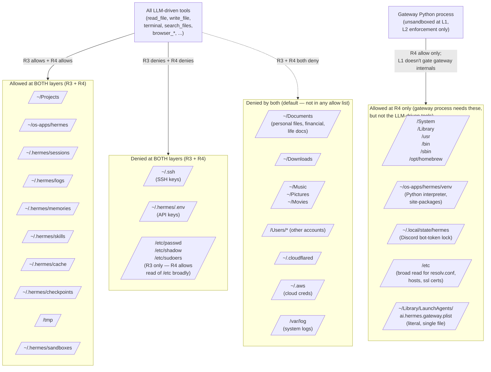
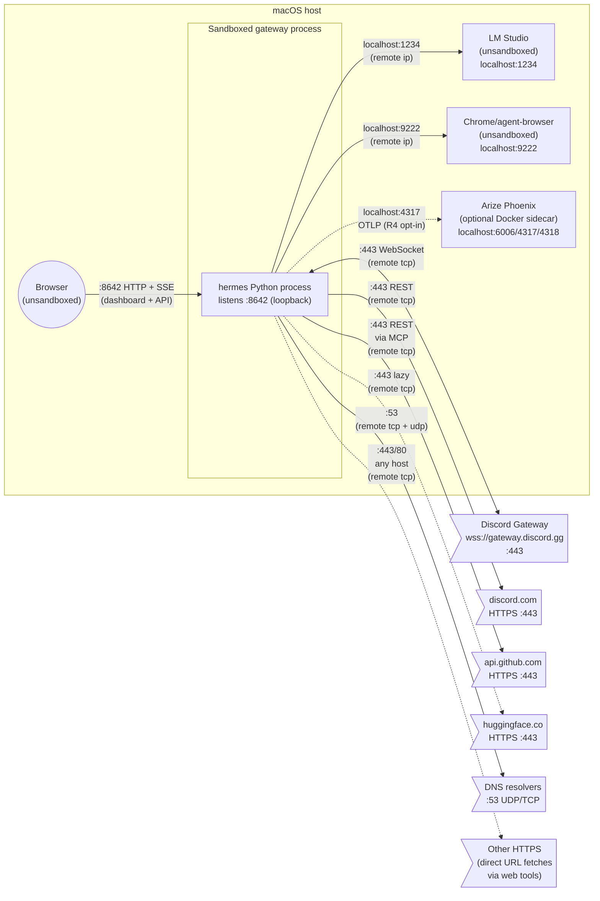

z# Hermes Agent — System Architecture

> **Snapshot**: 2026-04-11, post Dashboard v2 (W0 / F1–F5) deployment
> **Branch**: `enhance/hermes-dashboard-v2` (6 commits ahead of `main`, PR #4)
> **Live gateway**: `hermes gateway run` under `sandbox-exec -f ~/.hermes/hermes.sb`
> **Dashboard**: `http://127.0.0.1:8642/dashboard/` (loopback + bearer token)
> **Plan of record**: [`~/.claude/plans/cobalt-steering-heron.md`](../../../../.claude/plans/cobalt-steering-heron.md) (v2 — current)
> **Phase 5 plan**: [`~/.claude/plans/tranquil-dreaming-dragonfly.md`](../../../../.claude/plans/tranquil-dreaming-dragonfly.md)
> **Phase 4 plan**: [`~/.claude/plans/moonlit-moseying-salamander.md`](../../../../.claude/plans/moonlit-moseying-salamander.md)
> **Recon log**: [`.claude/rules/recon-findings.md`](.claude/rules/recon-findings.md)

This document is a multi-view architecture reference for the Hermes Agent
deployment running on Maxwell's Mac. It uses the C4 model (Context →
Container → Component) for the structural views, plus dedicated views
for security boundaries, request lifecycle, and filesystem topology. Each
diagram is self-contained — read whichever one answers your question.

When the system changes materially, update both the relevant diagram
and the `Snapshot` line at the top. Diagrams should describe what is,
not what was — historical context belongs in `recon-findings.md`.

---

## Notation key

| Shape | Meaning |
|---|---|
| `[Rectangle]` | Software system, container, or component (in scope) |
| `[/Slash/]` | File or persistent data store |
| `((Circle))` | Person / external actor |
| `>External system]` | External system (not part of Hermes; out of our control) |
| Dashed border | Trust boundary (sandbox, network perimeter, process boundary) |
| Solid arrow `-->` | Synchronous request/response or in-process call |
| Dashed arrow `-.->` | Asynchronous, lazy, or guarded path |
| Arrow label | Protocol or data type carried |

Most diagrams use Mermaid (`flowchart` or `sequenceDiagram`) so they
render in GitHub, VS Code, Obsidian, Cursor, and most markdown viewers
without external tooling.

---

## 1. System Context (C4 L1) — who talks to Hermes

The widest-angle view. One box for Hermes; everything else is an
external entity Hermes talks to. Use this to orient new contributors
or to scope a security review.



**Key facts the diagram makes visible**:

- Hermes is self-hosted on a single Mac. There are no cloud LLM providers
  in the live config — every chat completion goes through LM Studio on
  the same host. The custom provider config is at `~/.hermes/config.yaml`
  under `model.provider: custom` with `base_url: http://localhost:1234/v1`.
- Maxwell is the only user. `DISCORD_ALLOWED_USERS` in `~/.hermes/.env`
  is restricted to his Discord ID.
- The only inbound edge to Hermes is the Discord WebSocket. There is no
  HTTP server, no SSH, no CLI socket. The CLI is a separate `hermes`
  invocation Maxwell runs locally; it talks to the same `~/.hermes/`
  state but is a separate process.
- LM Studio runs **on the host, outside the Hermes sandbox**. This is
  a deliberate trust boundary — see Diagram 7.

---

## 2. Container Diagram (C4 L2) — process tree on the host

Shows how Hermes is composed at runtime. Each box is a separate process
or persistent file. Trust boundaries are dashed.

```mermaid
flowchart TB
    subgraph host["macOS host (kernel + user-space, unsandboxed)"]
        launchd["launchd<br/>PID 1<br/>(init)"]
        plist[/"~/Library/LaunchAgents/<br/>ai.hermes.gateway.plist"/]
        wrapper["hermes-gateway-sandboxed<br/>Python wrapper script<br/>(UNSANDBOXED — pre-loads .env)"]
        envfile[/"~/.hermes/.env<br/>(GitHub PAT, Discord token,<br/>LM Studio key)"/]
        sbexec["/usr/bin/sandbox-exec<br/>(transient — execs into hermes)"]
        profile[/"~/.hermes/hermes.sb<br/>Seatbelt profile"/]

        subgraph sandbox["KERNEL SANDBOX (Seatbelt MACF, deny default)"]
            hermes["hermes gateway<br/>Python process"]

            subgraph runtime["Hermes runtime (in-process)"]
                agent["Agent loop<br/>conversation, tool calling,<br/>compression, memory"]
                tools["Tool registry<br/>terminal, file, web,<br/>browser, mcp_*, etc."]
                approval["Approval gate<br/>tools/approval.py"]
                jail["Path jail<br/>tools/file_tools.py"]
                exec["Code execution<br/>RPC over /tmp/hermes_rpc/<br/>tools/code_execution_tool.py"]
                bus["Event bus (Phase 5 R1)<br/>gateway/event_bus.py<br/>in-process pubsub"]
                apiserver["API server (Phase 5 R2)<br/>aiohttp @ 127.0.0.1:8642<br/>/v1/* + /api/dashboard/* + /dashboard/"]
                session[/"~/.hermes/sessions/<br/>SQLite + JSONL"/]
                memory[/"~/.hermes/memories/<br/>USER.md, MEMORY.md"/]
                logs[/"~/.hermes/logs/<br/>gateway.log + .error.log"/]
                events[/"~/.hermes/events.ndjson<br/>(Phase 5 R1 — rotating 50 MB)"/]
                dashtoken[/"~/.hermes/dashboard_token<br/>(chmod 600 — Phase 5 R2)"/]
                lock[/"~/.local/state/hermes/<br/>gateway-locks/"/]
            end

            mcpgh["@modelcontextprotocol/<br/>server-github<br/>spawned via npx<br/>(child of hermes,<br/>also sandboxed)"]
        end
    end

    Browser(("Maxwell's browser<br/>Zen / Safari"))
    LMStudio>"LM Studio<br/>UNSANDBOXED on host<br/>localhost:1234"]
    DiscordWS>"Discord Gateway<br/>wss://gateway.discord.gg"]
    GitHubAPI>"api.github.com"]

    launchd -->|RunAtLoad + KeepAlive| plist
    plist -->|exec /usr/bin/python3<br/>hermes-gateway-sandboxed| wrapper
    wrapper -.->|read .env<br/>&#40;unsandboxed&#41;| envfile
    wrapper -->|execvp w/ env vars in os.environ| sbexec
    sbexec -->|apply -f| profile
    sbexec -->|execvp hermes gateway run| hermes
    hermes --> agent
    agent --> tools
    tools --> approval
    tools --> jail
    tools --> exec
    agent -.->|publish turn/llm events| bus
    tools -.->|publish tool.invoked/completed| bus
    approval -.->|publish approval.requested/resolved| bus
    bus -.->|tee rotating NDJSON| events
    bus -.->|SSE fanout| apiserver
    apiserver <-.->|bearer| dashtoken
    agent <-->|RW| session
    agent <-->|RW| memory
    hermes -->|append| logs
    hermes <-->|file lock| lock
    tools -.->|stdio JSON-RPC| mcpgh

    Browser -->|HTTP :8642<br/>dashboard UI + SSE| apiserver
    agent -->|HTTP completions| LMStudio
    hermes <-->|WebSocket :443| DiscordWS
    mcpgh -->|HTTPS :443<br/>uses GITHUB_PERSONAL_ACCESS_TOKEN| GitHubAPI
```



**Key facts**:

- The wrapper script (`scripts/sandbox/hermes-gateway-sandboxed`) is the
  only unsandboxed code Hermes ships. It exists to resolve a chicken-
  and-egg: `~/.hermes/.env` is denied at the kernel level inside the
  sandbox, but the gateway needs the API keys at startup. The wrapper
  reads `.env` in its own (unsandboxed) Python process, populates
  `os.environ`, then `execvp`s into `sandbox-exec`. The new process
  inherits the env vars before the sandbox is applied.
- `sandbox-exec` itself is transient — it parses the profile, applies
  it via the Seatbelt kernel API, then `exec`s into hermes. After that
  point, the hermes process IS the sandboxed process; sandbox-exec
  doesn't appear in `ps`.
- The MCP GitHub server runs as a child of hermes via `npx`, which means
  it inherits the same kernel sandbox. Anything it tries to do that
  violates the profile gets denied at the kernel level along with the
  parent.
- LM Studio is explicitly NOT in the sandbox — it's a separate Mac app
  running on the host listening at `localhost:1234`. Hermes reaches it
  via a network rule in the profile (`(remote ip "localhost:1234")`).
  This is the most important non-Hermes trust boundary.
- **The Phase 5 dashboard runs in the SAME process as the gateway.**
  There is no second server, no second port beyond :8642, no second
  auth scheme, no second sandbox. The aiohttp API server that hosts
  `/v1/*` (OpenAI-compatible) also hosts `/api/dashboard/*` and serves
  the built React bundle at `/dashboard/`. The event bus is an
  in-process singleton that fans events from the agent loop to the
  `/api/dashboard/events` SSE multiplexer. The dashboard's blast
  radius is identical to the gateway's.
- **Dashboard auth is a bearer token at `~/.hermes/dashboard_token`
  (chmod 600)**, SEPARATE from `~/.hermes/.env` so the Seatbelt deny
  rule on `.env` keeps holding. The token is minted on first
  `GET /api/dashboard/handshake` from loopback; subsequent requests
  send `Authorization: Bearer <token>`. It persists across gateway
  restarts so open browser tabs keep working.

---

## 3. Defense in Depth — security layer view

A security-focused view of the same system, showing where each Phase 4
gate sits and what threat it addresses. Read top-to-bottom: an LLM tool
call traverses each layer in order.

```mermaid
flowchart TB
    LLM(["LLM (Gemma 4 26B)<br/>untrusted token stream"])

    subgraph Layer1["LAYER 1 — App-level gates (R1, R2, R3, R5)"]
        direction TB
        R1["R1 — Kwarg allowlist<br/>tools/code_execution_tool.py:303<br/>strips force/background/etc<br/>before terminal RPC dispatch"]
        R2["R2 — non_interactive_policy<br/>tools/approval.py:669+<br/>cron / delegated / background<br/>fall through to dangerous-pattern check"]
        R3["R3 — Path jail<br/>model_tools.py:502 →<br/>file_tools.validate_path_operation<br/>checks safe_roots / denied_paths<br/>per tool call"]
        R5["R5 — Output truncation<br/>code_execution_tool._truncate_tool_result<br/>caps tool results at 4000 tokens<br/>forces chunked iteration"]
        Approval["Existing dangerous-pattern detector<br/>tools/approval.py:check_all_command_guards<br/>+ tirith + smart-approval (aux LLM)"]
    end

    subgraph Layer2["LAYER 2 — Kernel MACF (R4 — Seatbelt)"]
        direction TB
        Profile["~/.hermes/hermes.sb<br/>(deny default) + explicit allows<br/>file-read* / file-write* /<br/>network-outbound / network-bind"]
        Hardenies["Hard denies<br/>/Users/maxwell/.ssh<br/>/Users/maxwell/.hermes/.env"]
        Imports["import system.sb<br/>(dyld closure plumbing)"]
    end

    Layer3["LAYER 3 — Hardware virtualization<br/>DEFERRED to Phase 4b<br/>Colima (Lima on Virtualization.framework)<br/>Add when Phase 4 needs to execute<br/>untrusted code from scanned repos"]

    OS(["macOS XNU kernel<br/>filesystem + network syscalls"])

    LLM -->|tool_call JSON| R1
    R1 -->|filtered args| R2
    R2 -->|approved| R3
    R3 -->|allowed paths| R5
    R5 -->|capped result| Approval
    Approval -->|allowed cmd| Profile
    Profile --> Hardenies
    Hardenies --> Imports
    Imports -->|kernel checks at every syscall| OS
    OS -.->|future migration| Layer3

    classDef l1 fill:#ffe5cc,stroke:#cc7a00,stroke-width:1px,color:#000
    classDef l2 fill:#cce5ff,stroke:#0066cc,stroke-width:1px,color:#000
    classDef l3 fill:#eeeeee,stroke:#999,stroke-width:1px,stroke-dasharray:5 5,color:#000
    class R1,R2,R3,R5,Approval l1
    class Profile,Hardenies,Imports l2
    class Layer3 l3
```



**What each layer protects against**:

| Layer | Threat model | Failure mode |
|---|---|---|
| **L1 — App gates** | LLM smuggles dangerous kwargs (R1), cron runs without supervision (R2), agent reads forbidden files via tools (R3), greedy reads cause silent summarization (R5) | A bug in the dispatch path lets an LLM-driven call through. L1 is the FIRST line — fast, well-tested, but bypassable if there's a code defect. |
| **L2 — Kernel MACF** | All of L1's threats AND code-injection bugs in any Python dependency that lets the agent escape its tool surface | Kernel bug in Sandbox.kext or a TOCTOU race in symlink resolution. macOS-specific — no help against CVEs in the kernel itself. |
| **L3 — Hardware virt** | Kernel bug in macOS XNU itself, untrusted package postinstall scripts, npm install in scanned repos | Bug in Apple's Virtualization.framework (much smaller surface than ~300 MACF hooks). Not currently deployed. |

**Critical assertion** (also in the plan and recon-findings): the
inline path-jail (R3) is detection-only. It cannot defend against
TOCTOU symlink races or crafty shell parsing edge cases. **L2 is the
load-bearing security boundary** for autonomous Phase 4 operation.
L1 exists to fail fast with structured errors the agent can reason
about, AND to add defense in depth in case L2 has a profile gap.

---

## 4. Tool Dispatch Component View — how a tool call traverses Layer 1

Zoom in on a single tool call. This is the most important diagram for
anyone debugging a denial or extending the gate logic. It shows the
exact code path from `LLM emits tool call` to `tool handler runs`.



**Things this diagram makes visible**:

- There are TWO entry points to `handle_function_call`: directly from
  the agent loop (one tool call per LLM turn) AND from inside an
  `execute_code` sandbox (multiple tool calls in a Python script via
  `hermes_tools._call(...)`). Both paths converge at line 502.
- The R1 kwarg filter only fires on the `execute_code` path because the
  direct agent loop path constructs args from a typed schema and can't
  smuggle internal-only kwargs. The filter is belt-and-suspenders for
  the sandbox path where the LLM writes raw Python.
- The path jail (R3) is the FIRST check after `handle_function_call` is
  entered. It runs BEFORE `registry.dispatch`, so a denied call never
  reaches the tool handler at all.
- The `pre_tool_call` and `post_tool_call` hooks are
  **observe-only** — exceptions raised from them are caught and
  swallowed. The path jail is inlined directly into `handle_function_call`
  precisely because the hook system can't reject.
- The approval gate (`check_all_command_guards`) only runs for terminal/
  shell-like tools. File tools, web tools, and MCP tools bypass it
  entirely — those rely on the path jail and the kernel sandbox for
  safety.
- The output truncation (R5) runs at the END, on the result, regardless
  of which tool produced it.

---

## 5. Discord Message Lifecycle — sequence view

Time-ordered view of a single message: Maxwell types something in
Discord, the gateway processes it, the agent reasons, makes one or more
tool calls, and replies. Use this when debugging "where did Hermes get
stuck" or "which gate fired when".



**Things this diagram makes visible**:

- The LLM is hit TWICE per denied tool call: once to produce the call,
  once to react to the rejection. This is where R5 truncation matters —
  if the agent tries 5 reads in a turn, each capped at 4000 tokens, the
  conversation stays under the compression threshold.
- The path jail doesn't hide the denial from the agent — the jail
  returns a structured error that the agent reads and reasons about.
  This is intentional: the agent should understand WHY a tool failed
  so it can try a different approach instead of retrying.
- The session log (`~/.hermes/sessions/`) captures every turn including
  the tool call and the jail error. That's how the cron exercise
  verification was traced post-hoc.
- The kernel sandbox (R4) doesn't appear in the data flow for this
  case — R3 caught it first. R4 only fires when the agent tries
  something L1 missed (e.g. a shell command with a path inside a
  `bash -c "..."` quoted arg).

---

## 6. Filesystem Topology — what's allowed where

The filesystem boundaries the agent operates within. Two layers of
defense (R3 + R4) maintain consistent allow/deny lists, but there are
paths the gateway process needs at the kernel level that the agent
should never reach via tools.



**Maintenance rule**: changes to the path topology must be applied to
BOTH layers in lockstep. The canonical sources are:

- **L1 (R3)**: `security.safe_roots` and `security.denied_paths` in
  `~/.hermes/config.yaml`
- **L2 (R4)**: `(allow file-read* ...)` and `(deny file-read* ...)` in
  `~/.hermes/hermes.sb` (canonical copy at `scripts/sandbox/hermes.sb`)

If the two diverge, the agent will see inconsistent enforcement.
Specifically: a path that R3 allows but R4 denies will cause the agent
to attempt a tool call that succeeds at L1 but crashes at L2 with an
unhelpful errno. A path that R3 denies but R4 allows is the opposite
problem — wasted attempts before the L1 gate catches it.

The intentional gap is `KernelOnly`: paths the gateway process itself
needs at startup (Python venv, system frameworks, the launchd plist)
but that the agent has no business reading via tools. R3 doesn't list
these in `safe_roots`, so any LLM-driven attempt is denied immediately.
R4 allows them because they're needed by the parent process.

---

## 7. Network Topology — outbound + inbound trust boundaries



**Network rules in the live profile**:

```scheme
(allow network-outbound
  (remote ip "localhost:1234")      ;; LM Studio
  (remote ip "localhost:9222")      ;; Chrome DevTools Protocol
  (remote ip "localhost:4317")      ;; OTLP gRPC (R4 — opt-in)
  (remote ip "localhost:4318")      ;; OTLP HTTP (R4 — opt-in)
  (remote ip "localhost:6006")      ;; Arize Phoenix UI (R4 — opt-in)
  (remote ip "localhost:8642")      ;; Hermes dashboard (port-conflict check)
  (remote tcp "*:443")              ;; HTTPS — Discord, GitHub, HF, etc.
  (remote tcp "*:80")               ;; HTTP fetches
  (remote tcp "*:53")               ;; DNS over TCP fallback
  (remote udp "*:53"))              ;; DNS over UDP (default)

;; Phase 5 R2 fix: both network-bind AND network-inbound are required
;; for a TCP LISTENER to actually work. bind() alone is not enough —
;; listen() + accept() are covered by network-inbound. Discovered when
;; the dashboard aiohttp server got EPERM at listen() despite a valid
;; network-bind rule. Use (local tcp ...), NOT (local ip ...), for
;; TCP — the ip form parses but doesn't match.
(allow network-bind
  (local ip "localhost:*")          ;; legacy UDP compat
  (local tcp "localhost:*")         ;; TCP binds (dashboard + OAuth)
  (local udp "localhost:*"))
(allow network-inbound
  (local ip "localhost:*")
  (local tcp "localhost:*")         ;; the fix — covers listen() + accept()
  (local udp "localhost:*"))
```

**Key constraints discovered during deployment** (Phase 4 + Phase 5):

1. **`(remote ip "*:443")` parses but does NOT match outbound TCP.**
   Apple's own profiles (`bluetoothuserd.sb`, `cloudpaird.sb`) use
   `(remote tcp "host:port")` for non-localhost. The `ip` form is
   reserved for `localhost:N` literals. (Phase 4 R4.)
2. **`network-bind` alone is not enough for a TCP listener.**
   Seatbelt splits bind() and listen()/accept() into two distinct
   operations. `network-bind` covers bind(); `network-inbound` covers
   listen() + accept(). Miss either one and aiohttp's `TCPSite.start()`
   EPERMs. (Phase 5 R2 fix.)
3. **Seatbelt rejects IP literals in network addresses** with
   `"host must be * or localhost"`. Only the `*` and `localhost`
   hostnames are valid — no `127.0.0.1`, no `[::1]`.

**Trust boundaries**:

- **LM Studio is the most important non-Hermes trust boundary on the
  host.** The sandbox can reach it via `localhost:1234`, but LM Studio
  itself is unsandboxed and runs as Maxwell's user. If the agent
  somehow gets the LM Studio API to execute arbitrary code (which it
  doesn't expose, but worth knowing), that code would run outside the
  Hermes sandbox.
- **Discord is trusted by token, not by network ACL.** The sandbox
  allows `*:443` so the agent could in principle hit any HTTPS host.
  Defense in depth: Discord channel/user filtering happens at the
  application layer in `gateway/platforms/discord.py`, not via network
  ACLs.
- **Exactly ONE inbound listener: the dashboard at 127.0.0.1:8642.**
  Bound to the loopback interface only — nothing outside the host can
  initiate a connection. Auth is bearer token from
  `~/.hermes/dashboard_token`. The token bootstraps via a one-shot
  handshake route that requires the request to come from 127.0.0.1.
  The WhatsApp bridge and OAuth callback flows use the same bind rules
  when enabled; they are not enabled on this deployment.

---

## 8. Configuration & State Locations

Where state actually lives. Useful for backups, migrations, and
"what does this file do" lookups.

```mermaid
flowchart LR
    subgraph repo["Source repo (~/os-apps/hermes/)"]
        Code[/"hermes_cli/<br/>tools/<br/>gateway/<br/>cron/<br/>agent/"/]
        EventBus[/"gateway/event_bus.py<br/>(Phase 5 R1)"/]
        DashRoutes[/"gateway/platforms/<br/>dashboard_routes.py<br/>(Phase 5 R2)"/]
        DashUI[/"dashboard/<br/>(Phase 5 R3: React 19 +<br/>TanStack Router + shadcn)"/]
        Sandbox[/"scripts/sandbox/<br/>hermes.sb<br/>hermes-gateway-sandboxed<br/>validate-profile.sh"/]
        Tests[/"tests/<br/>event_bus + dashboard_routes<br/>+ otel + ...)"/]
        Plan[/".claude/rules/<br/>recon-findings.md<br/>architecture.md (this file)"/]
        Venv[/"venv/<br/>(uv-managed)"/]
    end

    subgraph hermesHome["~/.hermes/ (user state)"]
        Config[/"config.yaml<br/>(non_interactive_policy: guarded,<br/>safe_roots, denied_paths,<br/>max_tool_output, terminal.backend: local)"/]
        Env[/".env<br/>(secrets — API_SERVER_ENABLED=true<br/>enables Phase 5 dashboard)"/]
        Profile[/"hermes.sb<br/>(deployed copy of canonical)"/]
        Sessions[/"sessions/<br/>(SQLite + JSONL per chat)"/]
        Logs[/"logs/<br/>(gateway.log, gateway.error.log)"/]
        Memories[/"memories/<br/>(USER.md, MEMORY.md)"/]
        Skills[/"skills/<br/>(custom + bundled skill registry)"/]
        Cache[/"cache/<br/>(images, tts audio, hf models)"/]
        Checkpoints[/"checkpoints/<br/>(git-style snapshots for undo)"/]
        Events[/"events.ndjson<br/>(Phase 5 R1 — rotating 50 MB)"/]
        DashToken[/"dashboard_token<br/>(Phase 5 R2 — chmod 600)"/]
    end

    subgraph staticBundle["gateway/platforms/api_server_static/<br/>(gitignored, populated by npm build)"]
        DashDist[/"index.html<br/>assets/*.js, *.css"/]
    end

    subgraph launchAgents["~/Library/LaunchAgents/"]
        Plist[/"ai.hermes.gateway.plist<br/>(invokes wrapper)"/]
        PlistBackup[/"ai.hermes.gateway.plist.pre-sandbox<br/>(rollback)"/]
    end

    subgraph other["Other host paths"]
        LocalState[/"~/.local/state/hermes/<br/>(gateway-locks/discord-bot-token)"/]
        TmpRPC[/"/tmp/hermes_rpc_*.sock<br/>(per-task AF_UNIX sockets)"/]
        Plans[/"~/.claude/plans/<br/>moonlit-moseying-salamander.md"/]
        Memory[/"~/.claude/projects/-Users-maxwell-os-apps-hermes/memory/<br/>(Claude Code's auto-memory)"/]
    end

    repo -->|imported by Python<br/>at runtime| hermesHome
    launchAgents -->|launchd starts<br/>at boot| repo
    hermesHome <-->|read/write<br/>at runtime| other
```



**Backup-worthy state** (for any cold-restore exercise):
- `~/.hermes/.env` — secrets
- `~/.hermes/config.yaml` — runtime config
- `~/.hermes/sessions/` — conversation history + SQLite state DB
- `~/.hermes/memories/USER.md` and `MEMORY.md` — long-term memory
- `~/.hermes/skills/` — custom skills (if any)
- `~/.hermes/checkpoints/` — undo history
- `~/Library/LaunchAgents/ai.hermes.gateway.plist` — the launch agent itself

The repo is reproducible from git. The wrapper script and Seatbelt
profile live in the repo and are deployed to `~/.hermes/` by the
operator (currently Maxwell or the Phase 4 commit description).

---

## 9. Dashboard & Event Bus (Phase 5 + Dashboard v2) — component view

New in Phase 5: an in-process event bus that fans structured events to
a local web dashboard. Every layer of the agent runtime emits typed
events; a single SSE multiplexer pipes them to the browser. Dashboard
v2 (W0 / F1–F5, plan `cobalt-steering-heron`) adds the **control half**
on top of the Phase 5 observability skeleton — every section gets
mutation routes and operational depth without changing the trust
boundary or adding a second process.

```mermaid
flowchart LR
    subgraph runtime["Agent runtime (in-process, sandboxed)"]
        agent["run_agent.py<br/>turn.started/ended"]
        dispatch["model_tools.py<br/>tool.invoked/completed"]
        approval["tools/approval.py<br/>approval.requested/resolved"]
        compress["agent/context_compressor.py<br/>compaction"]
        cron["cron/scheduler.py<br/>cron.fired"]
        session["gateway/session.py<br/>session.started/ended"]

        bus["EventBus singleton<br/>gateway/event_bus.py<br/>(asyncio.Queue fanout,<br/>drop-oldest, fail-silent)"]

        tee[/"~/.hermes/events.ndjson<br/>(50 MB rotation, 3 backups)"/]
        otel["agent/otel.py<br/>(R4 — opt-in OTel/OpenLLMetry)"]
    end

    subgraph api["API server (same process)"]
        sse["GET /api/dashboard/events<br/>SSE multiplexer"]
        rest["REST /api/dashboard/*<br/>(observe + control)<br/>state · sessions · cron · approvals<br/>tools · skills · mcp · brain<br/>doctor · config · metrics · gateway"]
        metrics["gateway/metrics.py<br/>MetricsReader<br/>(rotation-aware NDJSON walker<br/>+ 30s per-window cache)"]
        handshake["GET /api/dashboard/handshake<br/>(loopback-only bearer bootstrap)"]
        static["GET /dashboard/*<br/>api_server_static/"]
    end

    subgraph browser["Browser (unsandboxed)"]
        ui["React 19 + TanStack Router (10 routes)<br/>Live · Brain · Sessions · Approvals · Cron<br/>Tools · Skills · MCP · Health · Config"]
    end

    agent -.-> bus
    dispatch -.-> bus
    approval -.-> bus
    compress -.-> bus
    cron -.-> bus
    session -.-> bus
    bus -.->|async writer task| tee
    bus -.->|per-subscriber queue| sse
    tee -.->|walks .ndjson + .1/.2/.3| metrics
    metrics --> rest

    dispatch -.->|start_tool_span<br/>&#40;no-op if disabled&#41;| otel
    otel -.->|OTLP gRPC :4317| Phoenix>"Arize Phoenix<br/>(optional)"]

    handshake -->|mint/return token| ui
    ui -->|Authorization: Bearer| rest
    ui -->|Authorization: Bearer<br/>&#40;streaming fetch&#41;| sse
    ui -->|GET static| static
```



**Event schema** (borrowed from OpenHands V1, extended for v2):

```json
{
  "type": "tool.invoked | tool.completed | turn.started | turn.ended |
           llm.call | approval.requested | approval.resolved |
           compaction | cron.fired | session.started | session.ended |
           session.forked | session.injected | session.deleted |
           session.exported | session.reopened |
           memory.added | memory.replaced | memory.removed |
           skill.installed | skill.removed | skill.reloaded |
           mcp.connected | mcp.disconnected | gateway.started",
  "ts": "2026-04-11T15:23:01.527901+00:00",
  "session_id": "20260411_152301_abc12345",
  "data": { "…": "per-type payload" }
}
```

### Dashboard v2 capability map (W0 / F1–F5)

| Wave / Feature                                     | Routes added                                                                                                                                                                                                                                                                                                                                            | What it lets the operator do                                                                                                                                                                                                                                                                                                                                                                                                                                                                                                                                                                                                                                                                                                                                               |
| -------------------------------------------------- | ------------------------------------------------------------------------------------------------------------------------------------------------------------------------------------------------------------------------------------------------------------------------------------------------------------------------------------------------------- | -------------------------------------------------------------------------------------------------------------------------------------------------------------------------------------------------------------------------------------------------------------------------------------------------------------------------------------------------------------------------------------------------------------------------------------------------------------------------------------------------------------------------------------------------------------------------------------------------------------------------------------------------------------------------------------------------------------------------------------------------------------------------- |
| **W0 — Foundation**                                | (no new public routes — adds `@require_dashboard_auth` decorator, `_json_ok`/`_json_err` helpers, `_tail_read_ndjson` + `_walk_ndjson_rotation` extractors, `apply_config_mutations` allowlist + dated backups, `approval_history` v7 schema, frontend `ToastProvider` / `ConfirmProvider` / `useApiMutation`, Sheet/Dialog/Textarea/Switch primitives) | Refactors 15 existing handlers to use the decorator. Wires `llm.call` instrumentation in the agent loop AND `auxiliary_client.call_llm` so F5 metrics actually has data. Adds the foundation everything else stands on.                                                                                                                                                                                                                                                                                                                                                                                                                                                                                                                                                    |
| **F1 — Session Control Plane**                     | `GET /sessions/search` · `DELETE /sessions/{id}` · `GET /sessions/{id}/export?format=json\|md` · `POST /sessions/{id}/fork` · `POST /sessions/{id}/inject` · `POST /sessions/{id}/reopen` · `POST /sessions/bulk`                                                                                                                                       | LangGraph-style time travel. Search by title + source + date, fork an ended session at any turn (preserving every column including reasoning + tool_calls JSON, validator finding #11), inject a user message into an ended session and auto-reopen, bulk delete or export with per-row error reporting. Backed by new `SessionDB.fork_session` + `render_session_markdown`.                                                                                                                                                                                                                                                                                                                                                                                               |
| **F2 — Brain / Memory Editor**                     | `POST /brain/memory` · `PUT /brain/memory/{hash}` · `DELETE /brain/memory/{hash}` · `GET /brain/export?store=…` · `POST /brain/import`                                                                                                                                                                                                                  | In-UI Letta-style memory CRUD on top of `MemoryStore.add/replace/remove`. Threat scanner + file lock are inherited unchanged — the dashboard route is a thin wrapper. Hash-addressed entries (8-char `_hash_entry` from `memory_tool.py`).                                                                                                                                                                                                                                                                                                                                                                                                                                                                                                                                 |
| **F3 — Live Console v2 + Approval Command Center** | `GET /events/search` · `GET /events/export` · `GET /approvals/history` · `GET /approvals/stats?window=…` · `POST /approvals/bulk`                                                                                                                                                                                                                       | Type-wildcard (`tool.*`) + q + session + window event search across rotated NDJSON files. NDJSON export download. New `/approvals` route with pending queue + bulk-resolve toolbar (Once/Session/Always/Deny) + history table + per-pattern stats sidebar over the last 7 days. Backed by the W0 v7 `approval_history` table.                                                                                                                                                                                                                                                                                                                                                                                                                                              |
| **F4 — Interactive Ops**                           | `GET /jobs/parse-schedule` · `POST /jobs/dry-run` · `POST /tools/{name}/toggle` · `GET /tools/{name}/schema` · **`POST /tools/{name}/invoke`** · `POST /skills/{name}/reload` · `GET /skills/{name}/full` · `POST /mcp/{name}/toggle` · `GET /mcp/{name}/health`                                                                                        | **Security-critical surface.** The new `/tools/{name}/invoke` route is the most likely regression point for the Phase 4 approval gate. It (a) recursively scrubs `force` / `skip_approval` / `unsafe` / `bypass` at every nesting level, (b) pre-checks dangerous shell patterns and returns 202 needs_approval BEFORE dispatch, (c) funnels through `model_tools.handle_function_call` which still applies the R3 path jail, and (d) sets `HERMES_GATEWAY_SESSION` so `check_all_command_guards` hits the gateway approval branch. The cron dry-run helper (`cron/jobs.dry_run_spec`) is non-persistent — never lands in `~/.hermes/cron/jobs/`. **Test gate**: `tests/gateway/test_tool_invoke_security.py` (8 cases, 4 plan assertions). If any fail, F4 does not ship. |
| **F5 — Telemetry + Safe Config Editor**            | `GET /metrics/tokens?window=…` · `GET /metrics/latency?window=…&group_by=…` · `GET /metrics/compression?window=…` · `GET /metrics/errors?window=…` · `GET /metrics/context` · `PUT /config` · `GET /config/backups` · `POST /config/rollback` · `GET /gateway/info` · `GET /gateway/restart-command`                                                    | Token / latency / compression / error metrics over 1h–30d windows. Live context gauge from the latest `llm.call`. Allowlisted YAML config edits via the W0 `apply_config_mutations` helper, with dated backup snapshots in `~/.hermes/config_backups/` and a rollback route. The gateway restart route returns the `launchctl kickstart` command **as a string** for the user to copy-paste — the dashboard cannot shell out from inside the sandbox.                                                                                                                                                                                                                                                                                                                      |

### v2 invariants (in addition to the Phase 5 invariants below)

- **Tool invoke route is the only place dashboard can drive a real
  side-effecting tool call.** Every other "control" route either edits
  config (allowlisted) or talks to SQLite. The route enforces the
  Phase 4 approval gate AND the path jail by routing through
  `handle_function_call`, then returns 202 needs_approval if a
  dangerous pattern matches.
- **Config mutations are allowlisted** (`hermes_cli.config.CONFIG_MUTATION_ALLOWLIST`).
  The list is small and explicit; `model.provider`, `model.base_url`,
  `mcp_servers.{name}.command`, and any non-allowlist key return 403.
  PyYAML drops comments — every write creates a dated backup AND a
  one-time pristine snapshot so the user can always restore.
- **Gateway restart from the dashboard returns a command string only.**
  It does NOT shell out. The Seatbelt sandbox would reject the call
  anyway; the design choice keeps the boundary obvious.
- **Approval history is fire-and-forget.** A failed `record_approval`
  write never blocks `resolve_gateway_approval`. The DB is only an
  audit trail, not part of the resolution path.
- **Schema bumped to v7.** Existing v6 databases auto-migrate via the
  `_init_schema` branch — `CREATE TABLE IF NOT EXISTS approval_history`
  + indexes. No data loss.

**Original Phase 5 invariants still hold**:

- `EventBus.publish()` is fail-silent and non-blocking. The agent
  loop MUST continue even if the dashboard is disconnected, the
  NDJSON file is full, or every subscriber has hung.
- Slow subscribers drop the oldest events rather than backpressuring.
  A frozen browser tab cannot stall the agent.
- The NDJSON tee lives under `~/.hermes/` (already R/W in the Seatbelt
  profile), so R1 required zero sandbox changes.
- The dashboard bearer token lives at `~/.hermes/dashboard_token`,
  SEPARATE from `.env`. This preserves the Phase 4 hard-deny on
  `.env` reads.
- `/api/dashboard/handshake` is the only route that bypasses auth,
  and only when the request comes from 127.0.0.1 / ::1. Every other
  route requires the bearer.
- LangGraph Agent Inbox's `accept | edit | response | ignore` schema
  is translated on the approval resolution endpoint:
  `accept → once`, `ignore → deny`. Edit/response are deferred.
- Dashboard failures are non-fatal to the gateway. Route registration
  is wrapped in try/except; if aiohttp is missing or the static
  bundle is absent, the gateway still boots with a warning and
  Discord keeps working.

**How to enable the dashboard** (one-time):

```bash
# 1. Enable the API server platform
echo 'API_SERVER_ENABLED=true' >> ~/.hermes/.env

# 2. Build the frontend bundle
make dashboard-build

# 3. Restart the gateway
make gateway-restart

# 4. Open the UI
open http://127.0.0.1:8642/dashboard/
```

**Optional observability (R4)** — opt-in only:

```bash
pip install -e .[observability]
export HERMES_OTLP_ENDPOINT=http://localhost:4317
make phoenix-up                    # docker compose up phoenix :6006
make gateway-restart
open http://localhost:6006
```

---

## 10. Phase 4 + Phase 5 + Dashboard v2 Commit Lineage (appendix)

For historical reference. The branch state as of this snapshot:

```
# Dashboard v2 — full control expansion (enhance/hermes-dashboard-v2, PR #4)
* 5e52a9b7 Dashboard v2 W2: F5 telemetry + safe config editor
* c5948fde Dashboard v2 W2: F4 interactive ops (security-critical)
* be6a8a01 Dashboard v2 W1: F3 live console v2 + approval command center
* 89157a00 Dashboard v2 W1: F2 brain memory editor
* 76441218 Dashboard v2 W1: F1 session control plane
* 40fcb07e Dashboard v2 W0: foundation (auth decorator, llm.call, config mutator)

# Phase 5 — dashboard (merged to main)
* db2a514d Phase 5 R2 fix: add network-inbound + (local tcp) to sandbox profile
* c870648d Phase 5 R4: optional OpenLLMetry + Phoenix sidecar observability
* 0de2f95d Phase 5 R3: dashboard frontend (TanStack Router + React 19 + shadcn/ui)
* 3666dc62 Phase 5 R2: dashboard backend routes on the existing aiohttp server
* 329ded2a Phase 5 R1: event-stream backbone for the dashboard

# Phase 4 — sandboxing (merged to main)
* f8e21c21 Phase 4 fix: allow sandbox writes to ~/.npm for GitHub MCP startup
* 5737bdd9 Phase 4 R4: live deployment under sandbox-exec via launchd
* cd23bd8e Phase 4 R4 (deploy): wrapper + .env-tolerant loaders + profile fixes
* f96e40a1 Phase 4 R2 (recon doc): correct scope — cron ticks hit gateway branch
* da9c8505 Phase 4 R3 (fix): extract bare / and ~/ from terminal commands
* 1480474c Phase 4 R4 (artifacts): Seatbelt profile + trace/validate scripts
* 783c891d Phase 4 R5 (code): per-tool-call output cap + docker doctor
* b0d5a46f Phase 4 R3: inline path jail in handle_function_call
* 8ea3142e Phase 4 R2: non-interactive approval policy (allow|guarded)
* ba3902e5 Phase 4 R1: close force=True RPC bypass in terminal tool
* c4985957 Phase 3 recon: capability breadth survey + compression tuning
```

Historical detail (probe results, recon findings, decision trade-offs)
lives in `recon-findings.md`. Implementation rationale and the
optimizer/validator pass that shaped the plan lives in
`~/.claude/plans/moonlit-moseying-salamander.md`.

---

## 11. Glossary

| Term | Meaning |
|---|---|
| **Agent loop** | The conversation manager in `agent/` that drives turn-by-turn tool calling against an LLM. One instance per session. |
| **CDP** | Chrome DevTools Protocol. Used by `browser_*` tools to drive a headless Chromium for web automation. |
| **execute_code** | A meta-tool that runs Python in a sub-process with restricted imports. Inside that sub-process the LLM can call other tools via `from hermes_tools import _call`, which round-trips through an AF_UNIX socket back to the parent. |
| **Gateway** | The long-lived process that listens to messaging platforms (Discord, etc.) and dispatches incoming messages to the agent loop. Opposite of the `hermes` CLI which is short-lived per-invocation. |
| **MACF** | Mandatory Access Control Framework. The kernel subsystem in XNU that Apple's Sandbox.kext hooks into to enforce SBPL profiles. ~300 hooks across ~450 syscalls. |
| **MCP** | Model Context Protocol. Standard for exposing tool servers to LLM clients. The GitHub MCP server is `@modelcontextprotocol/server-github` spawned via `npx`. |
| **Path jail** | Phase 4 R3. Inline pre-dispatch validation in `model_tools.handle_function_call` that extracts paths from tool args and checks them against `security.safe_roots` and `security.denied_paths` from `config.yaml`. |
| **R1, R2, R3, R4, R5** | Roadmap items from the Phase 4 Sandboxing plan. Mapped 1:1 to the commits in section 9. |
| **Realpath canonicalization** | `os.path.realpath(os.path.expanduser(...))`. Resolves symlinks and `..` segments. The path jail uses a custom variant that walks up to the nearest existing ancestor for non-existent paths so write-before-create operations work. |
| **Safe roots / denied paths** | The path-jail allowlist and denylist, configured under `security:` in `~/.hermes/config.yaml`. The Seatbelt profile (`~/.hermes/hermes.sb`) mirrors these lists at the kernel level. |
| **SBPL** | Sandbox Profile Language. Apple's S-expression DSL for `sandbox-exec` profiles. Officially "deprecated since 10.12" (the text format) but the underlying kernel enforcement is what Safari, Chrome, and Cursor's sandboxing all rely on, and it's still maintained in 2026. |
| **Seatbelt** | Apple's name for the sandbox-exec/Sandbox.kext system. Used interchangeably with "macOS sandbox-exec" in this doc. |
| **Smart approval** | An optional mode where dangerous commands flagged by the pattern detector get assessed by an auxiliary LLM before either auto-approving or escalating to a human prompt. Inspired by OpenAI Codex's guardian subagent. |
| **TOCTOU** | Time-of-check vs time-of-use. The class of race condition where a security check passes at moment T1 but the underlying state changes by the time the operation runs at T2. The path jail explicitly cannot defend against this — Seatbelt is the real defense. |
| **Wrapper** | `scripts/sandbox/hermes-gateway-sandboxed`. The Python script the launchd plist now invokes. Reads `.env` outside the sandbox, then `execvp`s into `sandbox-exec` so the secrets are in `os.environ` before the kernel deny on `.env` takes effect. |

---

## Maintenance

When adding or removing diagrams:

1. Update the table-of-contents-shaped intro paragraph
2. Update the `Snapshot` line at the top
3. If you change the section numbers, update cross-references in the
   text (search for "Diagram N" and "section N")
4. Don't add a diagram unless it answers a real question someone asked.
   Diagrams that exist "for completeness" rot the fastest.
5. Prefer extending an existing diagram over adding a new one. Each
   diagram should fit on a screen.

When the system changes:

1. Update the relevant diagram(s) in the same commit as the code change
2. Update the `Snapshot` line to today's date
3. If the change is a Phase 4-style reshape, also update
   `recon-findings.md` and the plan file

This document is checked into the repo at `.claude/rules/architecture.md`
so the next session, fork, or auditor sees the system state that
corresponds to whatever git ref they checked out.
