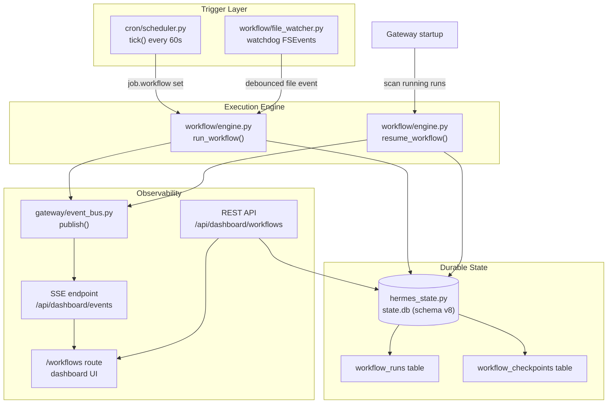
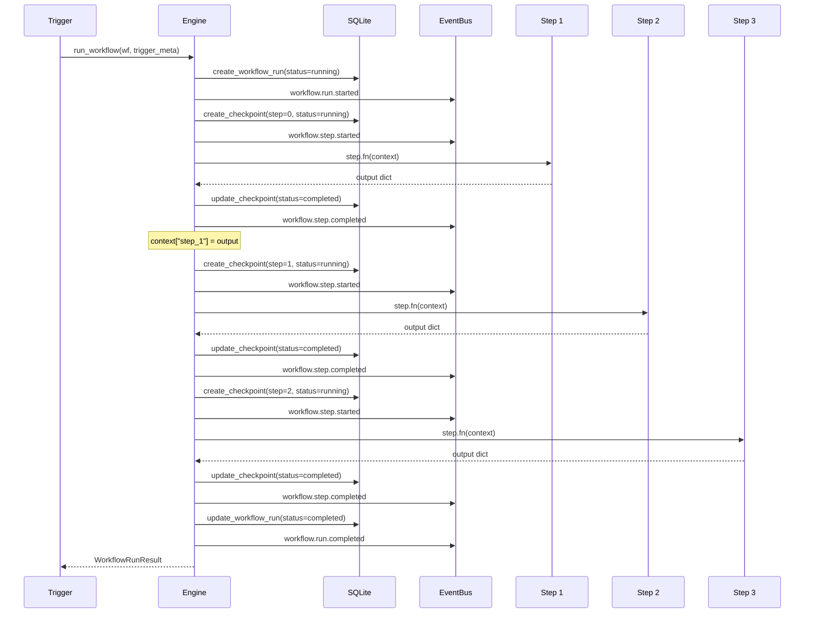
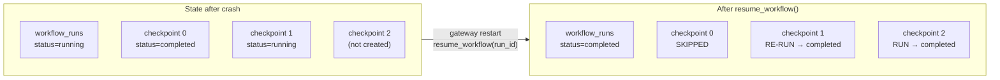
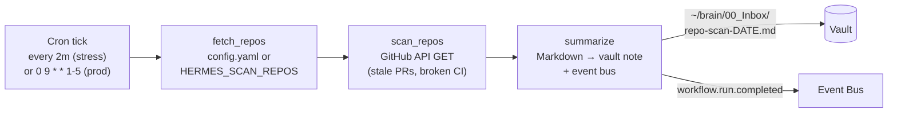
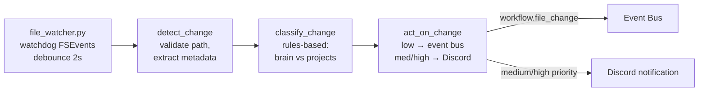

# Workflow Engine Architecture — Phase 7

> **Module**: `workflow/`
> **Plan**: `~/.claude/plans/silly-snuggling-gadget.md`
> **Recon doc**: `.claude/rules/recon-phase-7.md`

## Overview

The workflow engine runs multi-step autonomous tasks with durable
checkpointing. Each step is checkpointed to SQLite so workflows survive
gateway restarts and `kill -9`. Two harness workflows prove the
primitives; the winner gets promoted to production in Phase 8c.

## System flow



## Step execution model



## Crash recovery (resume)



## Harness A: morning-repo-scan



**Key constraint**: strictly READ-ONLY against GitHub. No mutations, no
merges, no comments. Hermes opens PRs, Maxwell reviews (premise P6).

## Harness B: watch-and-notify



**Classification rules**:
| Path pattern | Event | Classification | Priority |
|---|---|---|---|
| `brain/00_Inbox/*.md` | created | `new_note` | medium |
| `brain/00_Inbox/*` | deleted | `note_deleted` | low |
| `brain/01_Projects/*.md` | created | `project_note` | medium |
| `Projects/**/*.py` | any | `code_change` | low |
| `Projects/**/*.ts(x)` | any | `code_change` | low |
| Everything else | any | `file_change` | low |

## Database schema (v8)

```sql
CREATE TABLE workflow_runs (
    id TEXT PRIMARY KEY,          -- "wf_morning-repo-scan_1712880000123"
    workflow_id TEXT NOT NULL,     -- "morning-repo-scan"
    workflow_name TEXT NOT NULL,   -- "Morning Repo Scan"
    trigger_type TEXT NOT NULL,    -- "cron" | "file_watch"
    trigger_meta TEXT,             -- JSON
    status TEXT NOT NULL,          -- pending|running|completed|failed|cancelled
    started_at REAL NOT NULL,
    ended_at REAL,
    error TEXT,
    result_summary TEXT
);

CREATE TABLE workflow_checkpoints (
    id INTEGER PRIMARY KEY AUTOINCREMENT,
    run_id TEXT NOT NULL REFERENCES workflow_runs(id),
    step_name TEXT NOT NULL,
    step_index INTEGER NOT NULL,
    status TEXT NOT NULL,          -- pending|running|completed|failed|skipped
    started_at REAL,
    ended_at REAL,
    output_summary TEXT,           -- truncated to 500 chars
    error TEXT,
    UNIQUE(run_id, step_index)
);
```

## Event types

| Event | Data fields |
|---|---|
| `workflow.run.started` | run_id, workflow_id, workflow_name, trigger_type |
| `workflow.run.completed` | run_id, workflow_id, status, duration_s, step_count |
| `workflow.run.failed` | run_id, workflow_id, status, step_count |
| `workflow.run.resumed` | run_id, workflow_id, completed_steps, total_steps |
| `workflow.step.started` | run_id, workflow_id, step_name, step_index |
| `workflow.step.completed` | run_id, workflow_id, step_name, step_index, duration_s |
| `workflow.step.failed` | run_id, workflow_id, step_name, step_index, error |
| `workflow.file_change` | path, event_type, classification, priority, description |
| `workflow.notification` | message, source, priority |

## Test coverage (75 tests)

| File | Tests | Covers |
|---|---|---|
| `test_engine.py` | 26 | Schema v8, CRUD, run/resume, context, events, timeout |
| `test_morning_repo_scan.py` | 13 | Config/env sources, GitHub API mock, read-only safety, vault note, E2E |
| `test_file_watcher.py` | 13 | Debounce, excludes, shutdown, no-watchdog fallback |
| `test_watch_and_notify.py` | 15 | Classification rules, priority routing, E2E |
| `test_durability.py` | 8 | Forced-failure drill, idempotency, gateway restart |

## Stress test

`scripts/phase7-stress-test.py` compresses the observation week to ~20 minutes:

1. Morning-repo-scan every 2 min (~10 runs)
2. File churner every 15s + watch-notify triggers (~80 runs)
3. Three kill -9 drills at minutes 5, 12, 18
4. Automated measurement collection → `.claude/rules/recon-phase-7.md`

```bash
./venv/bin/python scripts/phase7-stress-test.py --repo travelinman1013/hermes-agent
./venv/bin/python scripts/phase7-stress-test.py --duration 10 --skip-kills  # quick test
```
